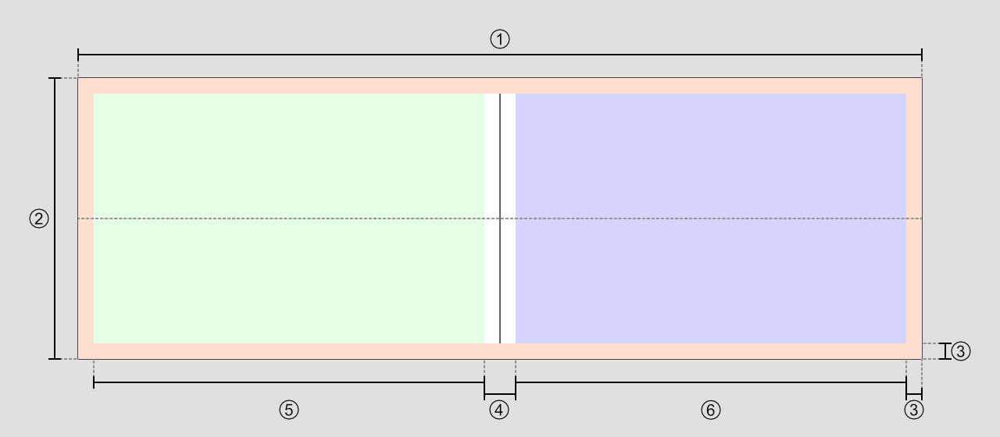
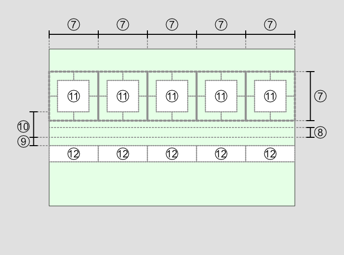
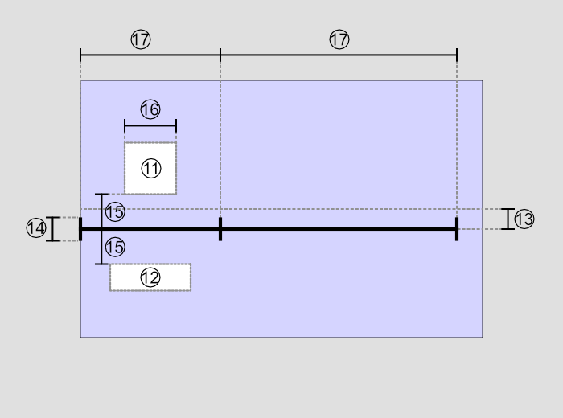

# SurViz

SurViz is a desktop application for visualizing stated choice survey data and exporting option visuals.

## Current status

- Core functionality implemented: NGene (.ngd) and CSV importers, bundled and user icon storage (PNG/SVG), image generation for situations/options, PNG and HTML exporters, and a preview UI with project settings.
- Configuration for image layout is available in src/main/resources/config/image_generator.properties.

## Usage

Build and run with Gradle:

```bash
./gradlew run
```

Package a native distribution for the current OS

1. Update the project version in build.gradle.kts

   - Open build.gradle.kts and set the version to the desired package version (for example: version = "1.0.1"). If you use the Compose nativeDistributions block, ensure packageVersion (or windows/mac/linux block settings) reflect the same value.

2. Build the distribution for the host OS:

```bash
./gradlew packageDistributionForCurrentOS
```

This task will create a native distribution (installer or bundle) for the operating system you run it on. The produced artifacts are placed under the build/ directory (e.g. build/compose or build/distributions depending on the plugin configuration).

Refer to the in-app Help window or notes/User_guide for detailed user instructions.

## Recent developer notes

- Codebase received documentation (KDoc) improvements and small refactors to ImageGenerator and IconStorage: property-access helpers and in-memory PNG resizing were added to reduce filesystem I/O and improve readability.


## Supported file types

### Input

#### Simulation data

- **.ngd** ([Ngene](https://www.choice-metrics.com/))

#### Icons

- **.png**
- **.svg**

### Output
- **.png** (whole situation or individual options)
- **.html** for [Unipark](https://www.unipark.com/)

## Internal Configuration

### ImageGenerator

The layout of the generated images can further be configured by changing the values in <code>image_generator.properties</code>.

>[!Warning]
>Changes to these values can lead to distorted images and improper functioning of the program.

The layout is based per single option in a situation.
The general layout of an option is as follows:



Green and blue area are representing the [single value](https://github.com/brndel/surviz?tab=readme-ov-file#single-value-section)/[timeline](https://github.com/brndel/surviz?tab=readme-ov-file#timeline-section) section. 
Further layout of those areas is explained in corresponding sections.


| Nr. | Identifier/Calculation                                                                                                            | Description                   | Unit |
|-----|-----------------------------------------------------------------------------------------------------------------------------------|-------------------------------|------|
| 1   | set by user; default=<code>situation_default_width</code>                                                                         | width                         | px   |
| 2   | <code>situation_height</code>                                                                                                     | height                        | px   |
| 3   | <code>border_padding</code>                                                                                                       | border padding                | px   |
| 4   | $2 \times$ <code>column_padding</code>                                                                                            | padding around divider line   | px   |
| 5   | $max($ <code>single_value_min_width</code> $,count(single values) \times$ <code>single_value_size</code> $)$                      | width of single value section | px   |
| 6   | $\text{width}-2\times$ <code>border_padding</code> $-2\times$ <code>column_padding</code> $-\text{width of single value section}$ | width of timeline section     | px   |

**Other general adjustments that can be made:**

| Identifier                    | Description               | Unit              |
|-------------------------------|---------------------------|-------------------|
| <code>background_color</code> | background color          | ARGB value in hex |
| <code>divider_weight</code>   | thickness of divider line | pt                |
| <code>divider_color</code>    | color of divider line     | ARGB value in hex |

#### Single value section



| Nr. | Identifier/Calculation                 | Description                                       | Unit |
|-----|----------------------------------------|---------------------------------------------------|------|
| 7   | <code>single_value_size</code>         | size of each single value column                  | px   |
| 8   | <code>single_value_y_offset</code>     | middle offset from center line                    | px   |
| 9   | <code>single_value_text_padding</code> | padding between center line and top pixel of text | px   |
| 10  | <code>single_value_icon_padding</code> | padding between center line and icon              | px   |

**Other adjustments that can be made:**

| Identifier                      | Description                                 | Unit              |
|---------------------------------|---------------------------------------------|-------------------|
| <code>single_value_alpha</code> | alpha value of single values with value $0$ | float between 0-1 |

**Other identifiers**

| Nr. | Description |
|-----|-------------|
| 11  | Icon        |
| 12  | Text        | 

#### Timeline section



| Nr. | Identifier/Calculation                                                                                 | Description                                 | Unit |     |     |
|-----|--------------------------------------------------------------------------------------------------------|---------------------------------------------|------|-----|-----|
| 13  | <code>timeline_y_offset</code>                                                                         | offset from center line                     | px   |     |     |
| 14  | <code>timeline_divider_height</code>                                                                   | height of divider between timeline sections | px   |     |     |
| 15  | <code>timeline_padding</code>                                                                          | padding of text and icons from timeline     | px   |     |     |
| 16  | <code>timeline_icon_size</code>                                                                        | width and height of icon                    | px   |     |     |
| 17  | $\text{value of section}\times \text{timeline scaling}$; default=<code>timeline_default_scaling</code> | length of timeline section                  | px   |     |     |

**Other adjustments that can be made:**

| Identifier                   | Description                | Unit |
|------------------------------|----------------------------|------|
| <code>timeline_weight</code> | line thickness of timeline | pt   |

## Adding features

### Importer

To add an Importer to support a new file type simply create a class that implements the <code>Importer</code> interface.
For the new Importer to be recognized by the rest of the program add <code>YourImporter</code> to <code>ImporterVariant</code>:

```kotlin
enum class ImporterVariant(private val importer: Importer) {
	Ngene(NgeneImporter),
	//....
	YourFileFormat(YourImporter),
	//....
}
```

### Exporter

Similar to adding an `Importer`, you just have to implement the `Exporter` interface. With `getFields()` the exporter can request inputs from the user for configuration.
`export`, as the name implies, is called when the user wants to export.
For the exporter to be shown in the UI, simply add `YourExporter` to `ExporterVariant`:

```kotlin
enum class ExporterVariant(private val exporter: Exporter) {
	//....
	YourExporterName(YourExporter),
}
```